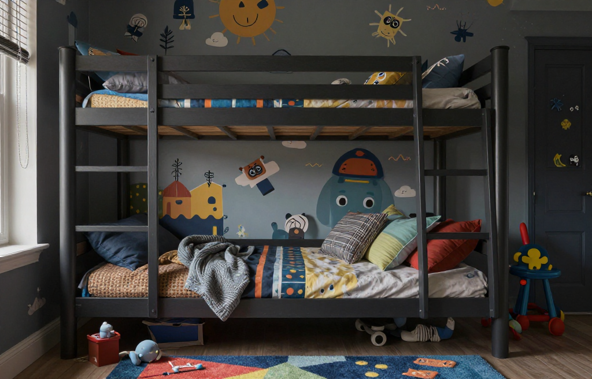
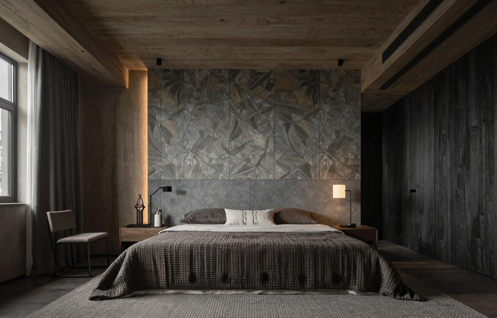
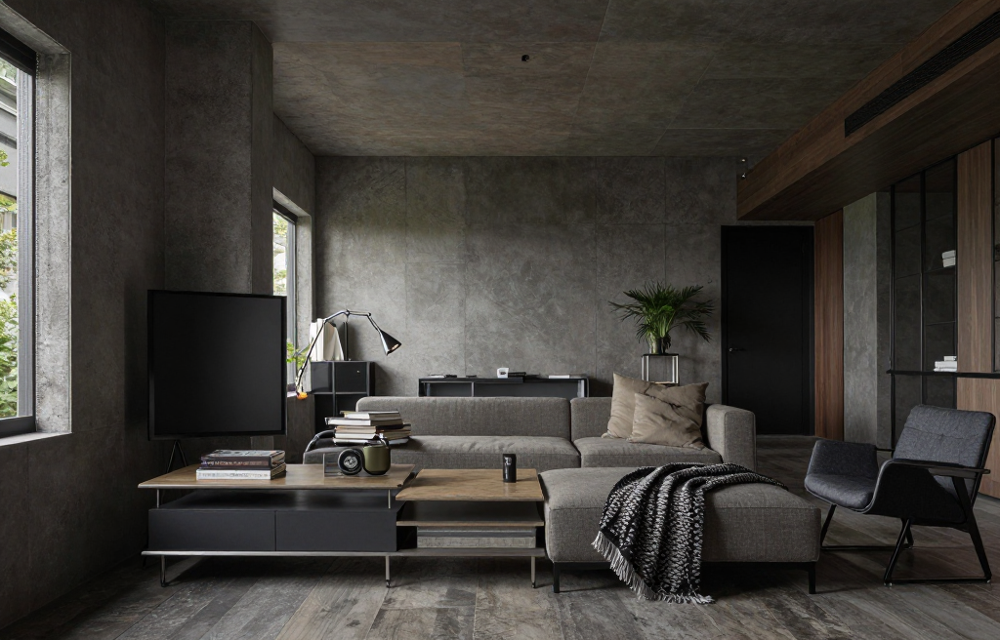
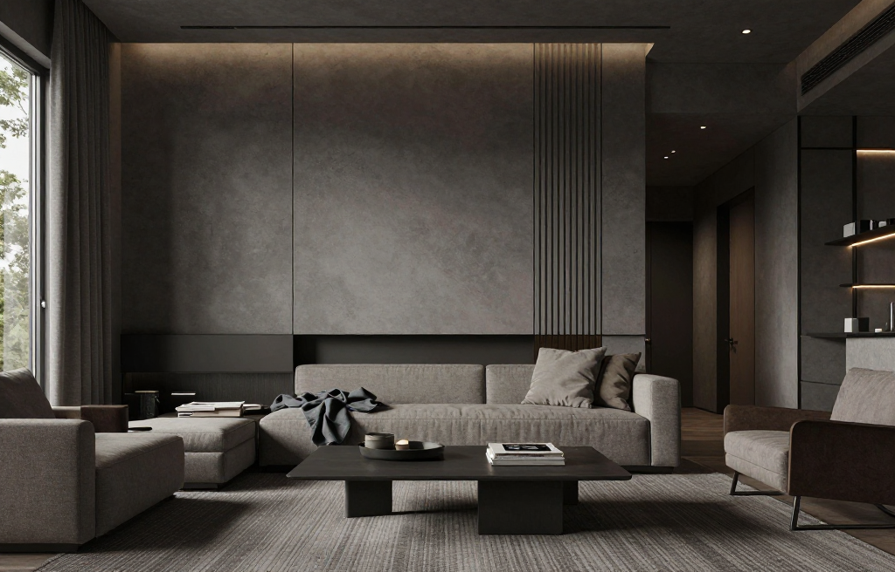
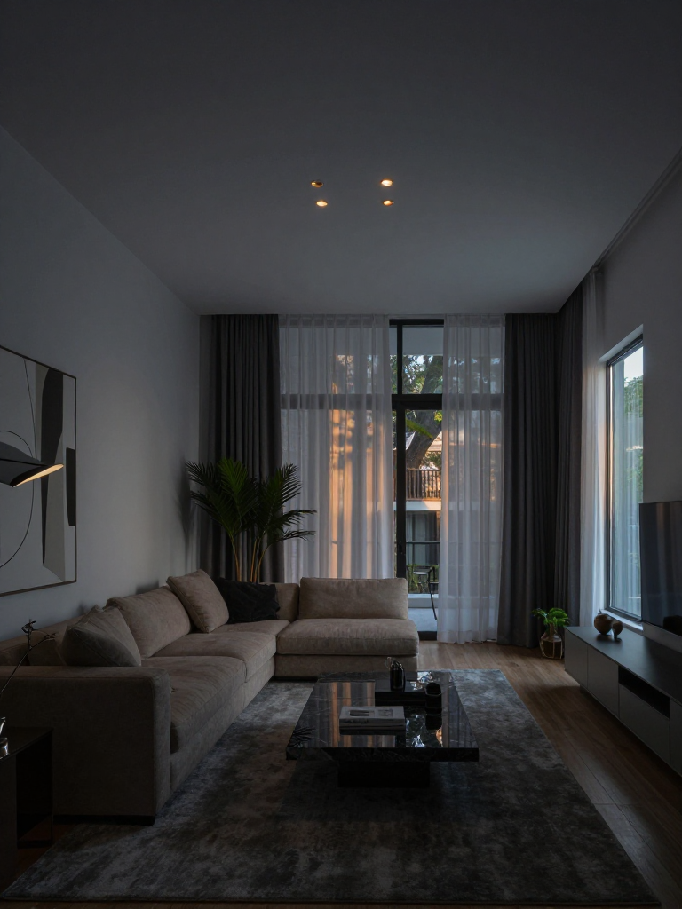
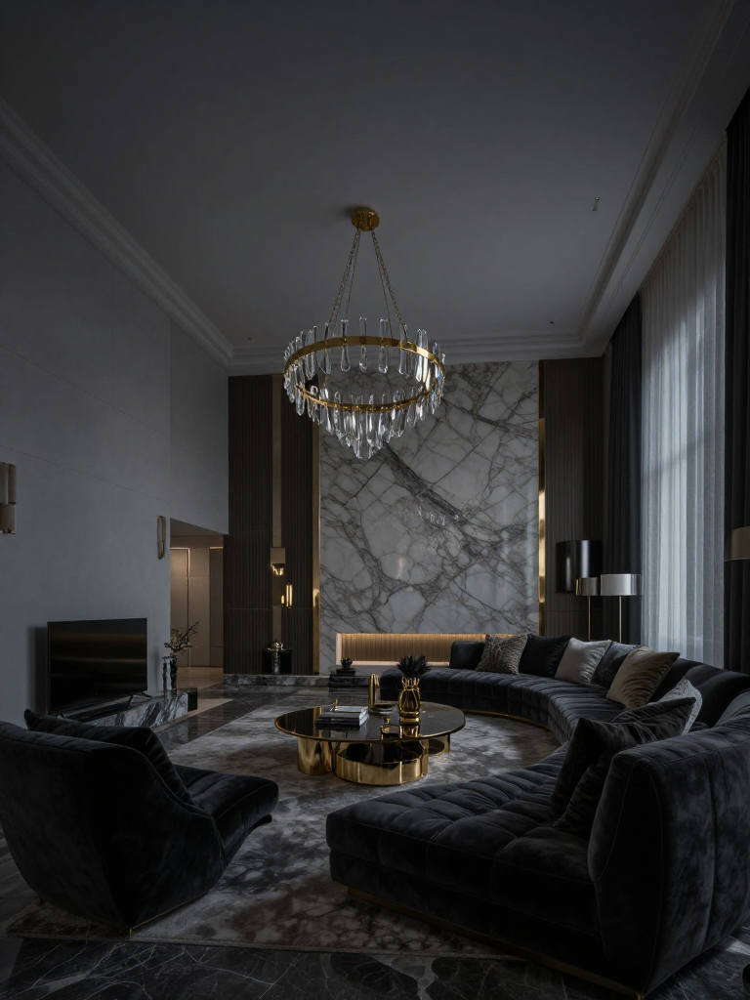
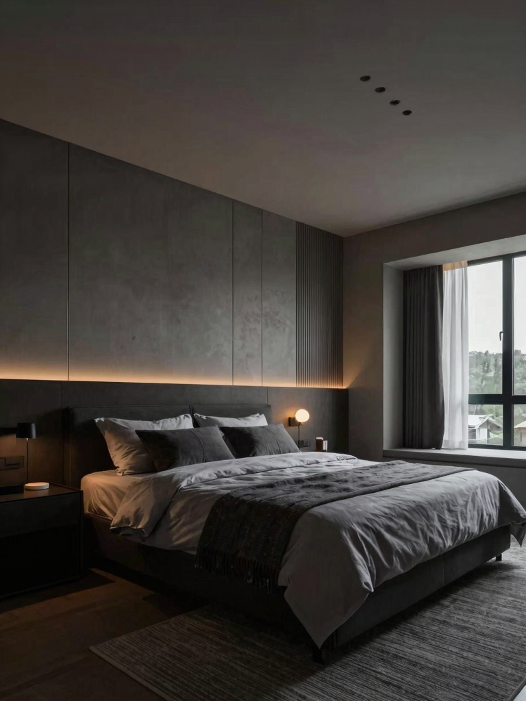

# Z-Image Turbo API — Interior Design Generation

A highly scalable, production-ready Interior Design REST API powered by Golang and Serverless GPUs via [Modal Labs](https://modal.com). This API enables lightning-fast **Image-to-Image** interior room redesign generation using the `Tongyi-MAI/Z-Image-Turbo` model, optimized for A10G GPUs.

## ✨ Features

- **Blazing Fast Image Generation:** Sub-second to few-second inference using Z-Image-Turbo on A10G.
- **Microservices Architecture:** 
  - **GPU Backend:** Python FastAPI app deployed natively to Modal's serverless GPUs. Scales to zero.
  - **API Gateway:** Lightning-fast Golang backend serving as the proxy router, handling CORS, health checks, and bridging requests seamlessly.
- **Mobile Client Ready:** 100% compatible with existing Flutter client apps. Handles `data:image/png;base64` natively.
- **Rich Aesthetic Options:** Built-in prompt engineering with auto-formatting for 10+ architectural styles and 7+ room types.
- **Optimized Memory Profiling:** Intelligent `diffusers` memory sizing, fallback to 768px on VRAM pressure to dodge Out-Of-Memory (OOM) errors.

---

## 📸 Sample Generated Images

Here are some of the remarkable generated images produced by this API directly from the codebase:

<div align="center">
  
  
</div>
<br>
<div align="center">
  
  
</div>
<br>
<div align="center">
  
  
</div>
<br>
<div align="center">
  
  
</div>

---

## 🚀 Installation & Setup

This API runs in two concurrent parts. You must first deploy the **Python model inference engine to Modal**, and then spin up the **Golang API Gateway**.

### Part 1: Deploying the Modal GPU Engine

1. **Install Python dependencies locally:**
   ```bash
   pip install modal
   ```

2. **Authenticate with Modal Labs:**
   ```bash
   modal setup
   ```

3. **Deploy (or serve) the application:**
   To run in development mode with hot-reloading:
   ```bash
   modal serve modal_app.py
   ```
   To deploy permanently to Modal"s cloud:
   ```bash
   modal deploy modal_app.py
   ```

   *Note: After deploying, Modal will give you a REST endpoint URL (e.g., `https://your-workspace--z-image-interior-design-fastapi-app.modal.run`). Save this URL.*

### Part 2: Running the Golang Gateway

1. **Install Go Modules:**
   ```bash
   go mod tidy
   ```

2. **Set Environment Variables:**
   You must point the Go server to your deployed Modal endpoint.
   ```bash
   export MODAL_URL="https://your-workspace--z-image-interior-design-fastapi-app.modal.run"
   export PORT=8080
   ```

3. **Run the Go Server:**
   ```bash
   go run .
   ```
   The API will now be listening locally at `http://localhost:8080`.

---

## ⚡ API Usage Examples

Once everything is running, you can hit the Golang gateway.

### 1. Check Health & Ready Status
```bash
curl http://localhost:8080/health
```

### 2. View Available Styles and Room Types
```bash
curl http://localhost:8080/api/interior/styles
```

### 3. Generate a Room Design (`/generate`)
This endpoint is specifically tuned to be backwards-compatible with standard Flutter applications.

**Request:**
```bash
curl -X POST http://localhost:8080/generate \
  -H "Content-Type: application/json" \
  -d '{
    "image": "base64_encoded_image_string_here...",
    "prompt": "make it look like a futuristic cyberpunk apartment",
    "num_inference_steps": 8,
    "strength": 0.67
  }'
```

**Response:**
```json
{
  "success": true,
  "image": "data:image/png;base64,iVBORw0KGgoAAAANSUhEUg...",
  "seed": 12849102,
  "width": 1024,
  "height": 1024,
  "detected_mode": "z-image-turbo",
  "mode_description": "Z-Image Turbo img2img"
}
```

### Tuning Variables
- **`strength`**: `0.4` (subtle details preserved), `0.6` (balanced redesign - default), `0.8` (strong architectural changes).
- **`num_inference_steps`**: `8` is standard for Turbo. 

---

## 🛠 Tech Stack

- **Go (Golang):** High-throughput Gin web framework.
- **Python:** FastAPI, Modal SDK.
- **HuggingFace Diffusers:** Custom implementation of `ZImageImg2ImgPipeline` with `Tongyi-MAI/Z-Image-Turbo`.
- **Infrastructure:** NVIDIA A10G Cloud GPUs (via Modal).
